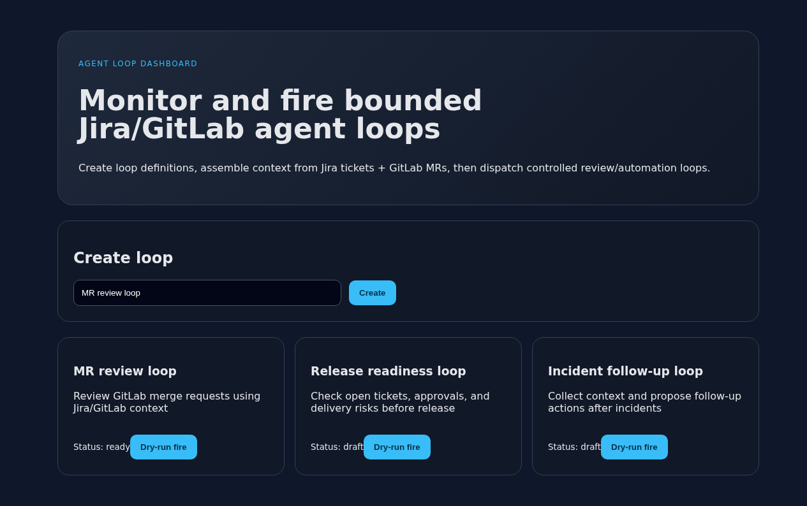

# Agent Loop Dashboard

Dashboard for monitoring, creating, and firing off bounded AI agent loops that work across self-hosted Jira and GitLab.

## Product idea

A Docker Compose-hosted internal tool that can:

- Pull Jira tickets from a self-hosted Jira instance.
- Read Jira ticket comments and GitLab MR comments as loop context.
- Create and review GitLab merge requests.
- Start/stop/monitor agent loops.
- Store loop definitions, runs, events, context snapshots, and review outcomes.
- Provide Loop CRUD via API and dashboard.

## Architecture

```text
User
  -> Node/React dashboard
  -> FastAPI backend / BFF
  -> Postgres
  -> Jira connector
  -> GitLab connector
  -> Agent runtime adapter
```

The backend owns auth, policy, loop state, audit events, connector calls, and approval boundaries. The agent runtime receives compact context packs and returns proposed actions/reviews.

## Quick start

```bash
cp .env.example .env
docker compose up --build
```

- Web: http://localhost:5173
- API: http://localhost:8000
- API docs: http://localhost:8000/docs
- Connector status: http://localhost:8000/connectors/status
- Runtime status: http://localhost:8000/runtime/status

## Anthropic runtime configuration

The backend is configured for the official Anthropic SDK using custom endpoint environment variables:

```env
ANTHROPIC_BASE_URL=http://host.docker.internal:9000
ANTHROPIC_AUTH_TOKEN=...
ANTHROPIC_MODEL_LABELS=fast=claude-3-5-haiku-latest,smart=claude-3-5-sonnet-latest
```

`ANTHROPIC_MODEL_LABELS` is a comma-separated `label=model` map. The first label becomes the default for new loops, and each loop stores its selected `model_label` so runs can choose models per loop without exposing raw credentials.

## Screenshots

Dashboard overview:


Dashboard with a loop in ready state:



## Tests and build

Backend API tests:

```bash
cd backend
uv run --with-requirements requirements-dev.txt python -m pytest tests -q
```

Frontend production build:

```bash
cd frontend
npm install
npm run build
```

## Current status

This repo is a v0 scaffold: API contracts, Docker Compose topology, connector boundaries, and initial dashboard shell.

## Safety model

- Secrets stay in `.env`, never committed.
- External side effects should be approval-gated.
- Agent loops should run with bounded capabilities per loop type.
- Jira/GitLab writes should be performed by backend connectors, not arbitrary agent tools.
